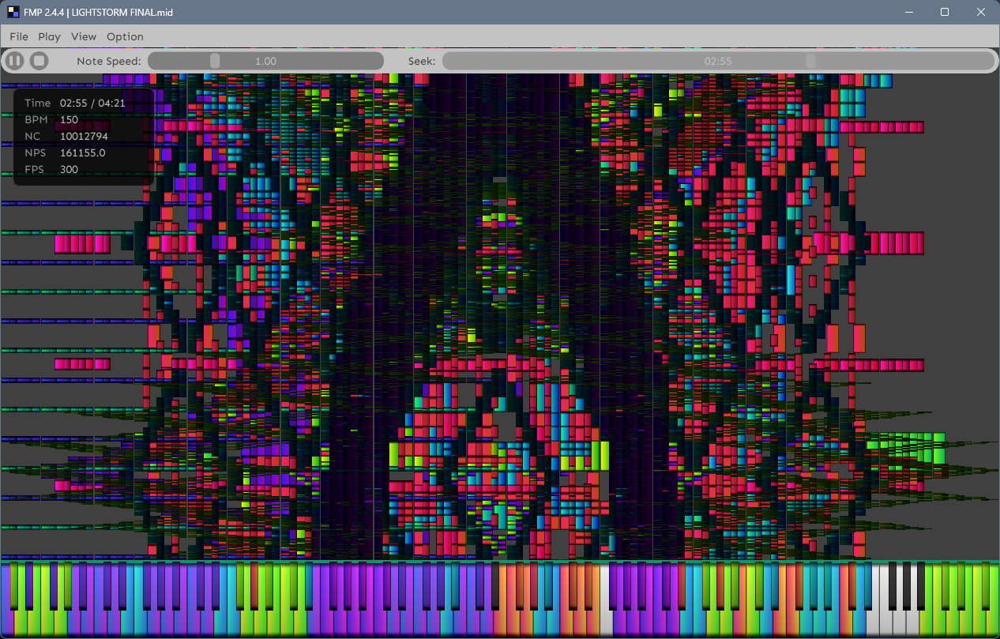

<h1 align="center">FRSK MIDI Player</h1>

A high-performance MIDI visualizer and player for Windows.

## Features

- Real-time falling-note visualization (2D / 3D)
- Built-in software synthesizer, or external output via KDMAPI (OmniMIDI)
- Animated piano keyboard with velocity response and glow effects
- Custom note color palettes via PNG image
- Timeline seeking, lyric display, NPS meter

## Requirements

- Windows 10 or later
- DirectX 11 capable GPU
- [OmniMIDI](https://github.com/KeppySoftware/OmniMIDI)

## Usage

1. Launch the application and open a `.mid` file.
2. Press Play to start playback.
3. Use the timeline slider to seek.

## Screenshot

